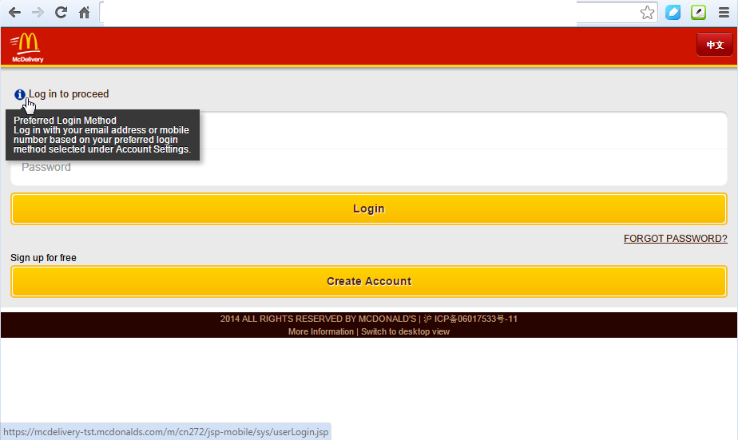
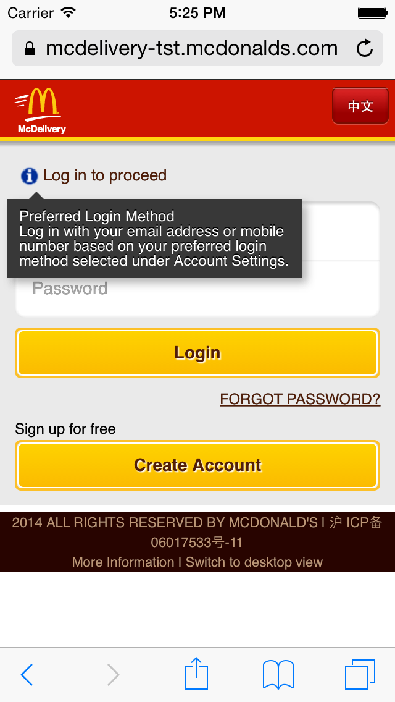
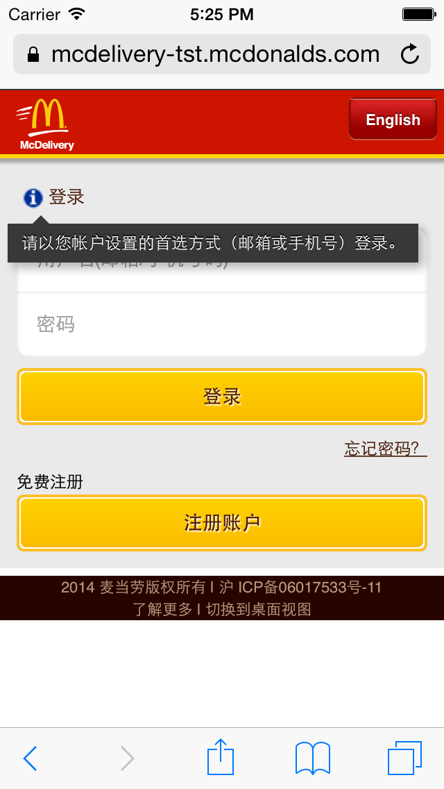

##Hint

Added hint message into the existing project:

This css is very easy to use. Saved for future use.

	<link rel="stylesheet" type="text/css" href="../style/00standard/css/hint.min.css">
	
	<h2><a class="hint--bottom" data-hint="<bean:message key="explanation.message.sign.in"/>" href=""></a></h2>
			

